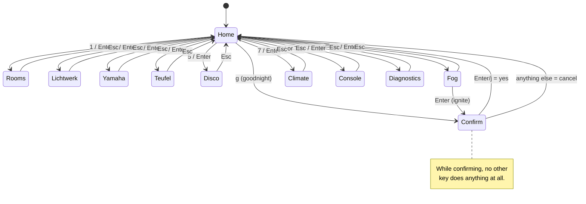

# Architecture

Two pieces: a Flask service on the Raspberry Pi that already runs the house,
and firmware on an ESP32-S3 that talks only to it.

```
      M5Cardputer ADV (ESP32-S3, 8 MB flash, no PSRAM)
      ┌───────────────────────────────────────────┐
      │ core (pure, tested on the host)           │
      │   dash · command · optimistic · netplan   │
      │   ui_state · ir_nec · ir_teufel           │
      ├───────────────────────────────────────────┤
      │ shell (adapters, verified on the device)  │
      │   display · keyboard · Wi-Fi task · IR    │
      └──────────┬──────────────────────┬─────────┘
                 │ HTTP, one request    │ 38 kHz NEC
                 ▼                      ▼
      ┌──────────────────────┐     Teufel amplifier
      │ gateway :5010 (Pi)   │
      │  aggregate (pure)    │
      │  actions   (pure)    │
      │  backends  (I/O)     │
      └──────────┬───────────┘
                 │ loopback, in parallel, hard timeouts
                 ▼
   hue:5000  yamaha:5001  teufel:5002  fog:5003  strip:5006
   disco:5007  climate:5008  garden:5009  weather:5011  monitor:4999
```

## Why the gateway exists

Four measurements, taken on the live system before any code was written:

**1. The payload.** Hue's `/api/lights` is **9 565 bytes** of raw bridge JSON
— colour gamuts, capabilities, product ids — and it grows with every lamp.
The ESP32-S3 in a Cardputer has **no PSRAM**. Parsing that on the device is
possible but pointless when 721 bytes carry everything a remote shows.

| endpoint | bytes |
|---|---|
| hue `/api/lights` | 9 565 |
| hue `/api/groups` | 2 518 |
| monitor `/api/metrics` | 1 660 |
| disco `/api/status` | 1 179 |
| weather `/api/weather` | 1 103 |
| strip, fog, teufel, climate | 86 – 336 each |
| **gateway `/api/dash`** | **721** |

**2. Reachability.** Three services — indoor climate, garden climate, weather
— are bound to `127.0.0.1` and are not reachable from the LAN at all. Without
a gateway on the Pi, the remote simply cannot show them.

**3. The Yamaha has no JSON.** `:5001/api/status` is a 404. The service is a
transparent proxy that forwards YamahaRemoteControl **XML** to the receiver.
Somebody has to parse XML; doing it on the Pi costs nothing and keeps ~4 KB of
receiver reply off the microcontroller entirely.

**4. Ports.** Port 80 on that Pi belongs to Pi-hole, so there is no plain-HTTP
route to the existing reverse proxy — only HTTPS on 8443.

### Why not TLS

An ESP32 mbedTLS session costs roughly 40 KB of heap and a handshake measured
in hundreds of milliseconds, on a device whose entire selling point here is
being usable within a second of a key press. Certificates also expire, and a
remote that stops working because a certificate rotated is a bad remote.

Inside the LAN the gateway speaks plain HTTP and gates access with a shared
secret instead. The LAN is explicitly *not* treated as trusted: without a
token you get 401, and the service refuses to start without one, because a
guest on the Wi-Fi should not be able to ignite a fog machine.

### The argument that actually settles it

Firmware is the hardest thing in the house to update. The gateway keeps every
fragile detail — which port, which JSON shape, which XML dialect, which field
renamed itself — on the side that changes with `git pull`. The firmware sees
one stable contract.

## Gateway internals

Pure and impure are kept apart, which is what makes the interesting half
testable on a laptop:

- **`aggregate.py`** — dicts in, dict out. Turns eleven backend replies into
  the flat snapshot. No sockets, not even a clock: the caller passes `now`.
- **`actions.py`** — `plan(target, action, params, state) -> Plan`. Decides
  *what* request to make and never makes one. Every clamp, whitelist and the
  fog interlock live here and are covered by tests.
- **`backends.py`** — the only part that opens a socket. A thread pool fetches
  all sources at once with a hard timeout.
- **`app.py`** — Flask, ~150 lines: auth, cache, dispatch.

### Parallel fetch with hard timeouts

Sources are fetched concurrently with a 1.5 s ceiling each. A device that does
not answer degrades to `old` in the snapshot; it never delays it. This is a
direct lesson from this house: a powered-down Yamaha once exhausted a 2 s
timeout inside a `Promise.all` and froze the whole dashboard refresh.

Slow-moving sources (weather, climate, Pi health) run on a separate 60 s
clock. Polling weather every second would burn Pi cycles and, over the radio,
battery — for data that changes hourly.

### `err` versus `old`

The snapshot distinguishes *never arrived* from *last known value*, and that
distinction is carried all the way to the pixels. A source in `old` is drawn
dimmed with the snapshot age in the header; it is never blanked.

The rule it enforces: **a failed poll is not "no data"**. Verified live by
killing a backend under a running gateway — the value stayed, `old` appeared.

## Firmware internals

### Screens



Arrows and Enter reach every screen; the digits are a shortcut, not a
requirement. That distinction was learned the hard way — see
[PITFALLS.md](PITFALLS.md).

### The core / shell split

Everything deterministic is in `firmware/lib/core`, compiles for the host, and
runs under `pio test -e native`:

| module | what it decides |
|---|---|
| `dash` | the model of the house and how a snapshot is parsed into it |
| `keymap` | a keyboard report to a key press |
| `command` | fuzzy matching for the typed command line |
| `optimistic` | which local assumptions override the snapshot, and for how long |
| `controls` | every app screen as rows: what each row shows, what a key on it sends |
| `reset_gesture` | when a held key means "wipe the credentials" |
| `netplan` | poll intervals, backlight steps, sleep threshold, backoff |
| `ui_state` | screens, key handling, the confirmation gate |
| `ir_nec` | NEC bit framing (the arithmetic, not the timing) |
| `ir_teufel` | the code table, generated from the canonical CSV |

The shell in `firmware/src` draws, reads keys, runs the radio and toggles a
GPIO at 38 kHz. It decides as little as possible.

That "as little as possible" is a correction, not a boast. The shell was first
written as a layer too thin to be worth testing, and it then held the two
worst defects in the project: a keyboard read that called the vendor's
*consuming* `isChange()` twice, so every key press was detected and then read
back as empty, and a home screen whose cursor was never drawn while Enter had
no handler at all. Both were invisible to every test and to every review,
because nothing was looking.

So the mapping moved into `keymap` where it is tested, and what genuinely
cannot leave the shell is pinned against its own source by
`tools/tests/test_firmware_shell.py`: one `isChange()` per read, no direct
keyboard polling in `loop()`, no arrow mapping outside the core. Weaker than
running it, and far stronger than nothing. See [PITFALLS.md](PITFALLS.md).

### Nothing blocks the key handler

The radio lives on its own FreeRTOS task pinned to core 0; the UI runs on core
1. A press enqueues a job and returns immediately. Replies are collected in
the main loop and merged.

A press that arrives *during* a reconnect is queued, not dropped. Nothing
feels slower than a remote that swallows input because it is "still
connecting".

Three details of that queue exist because their absence was a bug:

- **Snapshot polls coalesce.** At most one snapshot request waits in the job
  queue; a second is folded into it. Without this an outage filled the queue
  with polls, presses were dropped silently, and the worker never stopped
  reconnecting — so `busy()` never dropped and the device could not sleep.
- **Polls back off, presses always try.** After a failed association the
  worker sets a retry time (`core::backoffDelay`); snapshot jobs fail at once
  until then, a press still gets its attempt. A dead radio must not keep the
  device awake.
- **Verdicts have their own queue.** The newest snapshot is all that matters,
  so snapshots use a length-1 overwrite slot. An action's verdict must never
  be lost — a snapshot landing right after a refusal used to overwrite it and
  the optimistic change stayed on screen with nobody to roll it back — so
  verdicts queue separately, as deep as the job queue, and drain first.

### Optimistic rendering

A press changes the screen now; the request follows behind it.

```mermaid
sequenceDiagram
    autonumber
    participant K as Keyboard
    participant U as UI task (core 1)
    participant N as Net task (core 0)
    participant G as Gateway (Pi)

    K->>U: ';' or Enter
    U->>U: claim: room 81 -> on
    U-->>K: screen updates immediately
    U->>N: queue action (non-blocking)
    N->>G: POST /api/act
    G-->>N: 200 {applied:{hue:{group:81,on:true}}}
    N-->>U: result
    Note over U: next snapshot agrees →<br/>claim retires, nothing flickers

    K->>U: ';' again
    U->>U: claim: room 81 -> off
    U-->>K: screen updates immediately
    U->>N: queue action
    N->>G: POST /api/act
    G-->>N: 502 (backend did not answer)
    N-->>U: result: failed
    U-->>K: roll back + "fehlgeschlagen"
```

Each press records a short-lived **claim** about one field that overrides the
snapshot until either

- a fresher snapshot agrees (the claim retires silently, nothing flickers), or
- the gateway refuses (the claim is dropped and the screen rolls back with a
  message), or
- it simply expires after 4 s (the house never agreed, so stop pretending).

Repeated presses on the same field reuse one slot, so holding `+` is one
moving claim rather than eight stacked ones.

### The unconfirmed path

Infrared has no acknowledgement. A claim made over IR is marked `viaIr`, lives
longer (10 s), and is **never** retired by the network agreeing — because the
Pi's own view of the Teufel is itself an estimate, so agreement proves nothing.
The header says `IR unbestaetigt` while such a claim is live, and the Teufel
tile carries a `~` on every frame regardless.

Two control paths that both claim certainty are worse than one.

## Saying what is wrong

The device has no cable and no console. `d` on the home screen reports link
state, its own IP, the exact URL last requested, the last HTTP status or
transport error, request and failure counts, whether a snapshot was ever
parsed, free heap and worker stack headroom.

It exists because this project spent three rounds inferring what a device was
doing from a description of its screen. One screen separates "no Wi-Fi" from
"gateway refuses" from "reply will not parse". It sends nothing: a diagnostics
screen that switches things would be a hazard exactly when somebody is poking
at a misbehaving device.

## Power, and the second it has to answer in

The device is a remote: it lies around and gets picked up. So it sleeps —
display off, radio off, ESP32 in deep sleep — while the **TCA8418 keyboard
controller keeps scanning the matrix on its own** and pulls its interrupt line
(GPIO 11, inside the ESP32-S3 RTC domain) on a press. That is what makes
"wake on keypress" possible at all, and it is specific to the ADV.

The conflict this creates: a Wi-Fi association typically takes 1–3 s, and
"usable in under a second" does not tolerate that. Three levers, all three
used:

1. **No scan.** BSSID, channel and the previous lease live in RTC memory, and
   the association is made directly (`WiFi.begin(ssid, pass, channel, bssid)`
   plus a static `WiFi.config`). This is the single biggest win. A hint older
   than 24 h, or one that fails, is discarded so a moved access point costs
   one slow connect rather than permanent failure.
2. **Draw before the radio.** The last snapshot is in RTC memory too. On wake
   it is parsed and drawn immediately, deliberately aged so it renders as
   stale, and replaced when fresh data lands. The user sees a usable screen in
   milliseconds instead of a spinner.
3. **Queue, do not block.** See above.

`millis()` restarts at zero after deep sleep, so a snapshot restored from RTC
memory carries a timestamp in the *future*. `ageMs()` treats that as maximally
old rather than fresh — guessing "fresh" there would present week-old values
as current, and that is the dangerous direction.

Backlight drops to dim at 12 s, off at 25 s, and the device sleeps at 30 s —
but **never while a request is in flight**, because the reply would be lost
and the press would silently undo itself on the next wake.

**These numbers are policy, not measurement.** Quiescent current and
wake-to-usable time were not measured — no device was attached. See
[MEASURE.md](MEASURE.md); `tools/sleep-probe/` answers the sleep question
first, before anything is built on top of it.

## The IR table is generated, not copied

The Teufel codes already exist in this house, captured once from the original
remote. They are copied verbatim into `vendor/teufel-ir-mapping.csv` with
provenance, and `tools/gen_ir_table.py` renders them into
`firmware/lib/core/ir_teufel.h` with a checksum of the input.

A hand-copied table drifts, and a drifted IR table fails *silently*: the LED
blinks, the amplifier ignores it, and nothing anywhere reports an error.

One code is known bad: `MUTE` (0x28) reaches the box and does nothing, while
power and volume work. The byte is mislabelled in the original capture and the
cause is unknown. The firmware still offers it and says so in a toast rather
than letting the user conclude the remote is broken.
